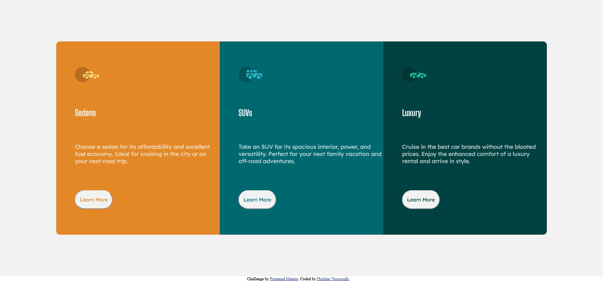

# Frontend Mentor - 3-column preview card component solution

This is a solution to the [3-column preview card component challenge on Frontend Mentor](https://www.frontendmentor.io/challenges/3column-preview-card-component-pH92eAR2-). Frontend Mentor challenges help you improve your coding skills by building realistic projects.

## Table of contents

- [Overview](#overview)
  - [The challenge](#the-challenge)
  - [Screenshot](#screenshot)
  - [Links](#links)
- [My process](#my-process)
  - [Built with](#built-with)
  - [What I learned](#what-i-learned)
  - [Continued development](#continued-development)
  - [Useful resources](#useful-resources)
- [Author](#author)
- [Acknowledgments](#acknowledgments)

**Note: Delete this note and update the table of contents based on what sections you keep.**

## Overview

### The challenge

Users should be able to:

- View the optimal layout depending on their device's screen size
- See hover states for interactive elements

### Screenshot



### Links

- Solution URL: [Add solution URL here](https://github.com/feihachim/three-card-component)
- Live Site URL: [Add live site URL here](https://feihachim.github.io/three-card-component/)

## My process

### Built with

- Semantic HTML5 markup
- CSS custom properties
- Flexbox

### What I learned

I have learnt how to access child elements of a CSS selector,also how to use custom fonts

Here are some samples of my code:

```html
<link rel="preconnect" href="https://fonts.googleapis.com" />
<link rel="preconnect" href="https://fonts.gstatic.com" crossorigin />
<link
  href="https://fonts.googleapis.com/css2?family=Lexend+Deca&display=swap"
  rel="stylesheet"
/>
<link
  href="https://fonts.googleapis.com/css2?family=Big+Shoulders+Display:wght@700&display=swap"
  rel="stylesheet"
/>
```

```css
.card:nth-of-type(1) > button {
  color: hsl(31, 77%, 52%);
}
```

If you want more help with writing markdown, we'd recommend checking out [The Markdown Guide](https://www.markdownguide.org/) to learn more.

### Continued development

I would like to refine my layout shifting skills.

### Useful resources

- (https://www.codegrepper.com/code-examples/css/button+edges+rounded+css) - This helped me for making rounded edges on buttons. I really liked this pattern and will use it going forward.

## Author

- Github - [Hachim Youssoufa](https://github.com/feihachim)
- Frontend Mentor - [@feihachim](https://www.frontendmentor.io/profile/feihachim)
